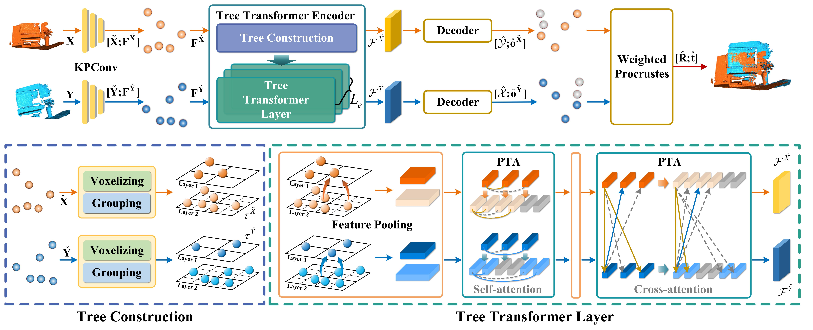

# Point Tree Transformer for Point Cloud Registration [ArXiv](https://arxiv.org/pdf/2406.17530)

In this work, we propose the Point Tree Transformer (PTT), a novel transformer-based approach for point cloud registration that efficiently extracts comprehensive local and global features while maintaining linear computational complexity. The PTT constructs hierarchical feature trees from point clouds in a coarse-to-dense manner, and introduces a novel Point Tree Attention (PTA) mechanism, which follows the tree structure to facilitate the progressive convergence of attended regions towards salient points.



If you find this useful, please cite:

```
@article{wang2024point,
  title={Point Tree Transformer for Point Cloud Registration},
  author={Wang, Meiling and Chen, Guangyan and Yang, Yi and Yuan, Li and Yue, Yufeng},
  journal={arXiv preprint arXiv:2406.17530},
  year={2024}
}
```

## Dataset environment

Our model is trained with the following environment:

- Python 3.8.8
- PyTorch 1.9.1 with torchvision 0.10.1 (Cuda 11.1)
- [PyTorch3D](https://github.com/facebookresearch/pytorch3d) 0.6.0
- [MinkowskiEngine](https://github.com/NVIDIA/MinkowskiEngine) 0.5.4
- [pointops](https://github.com/dvlab-research/Stratified-Transformer)

Other required packages can be installed using pip: `pip install -r src/requirements.txt`.

## Data and Preparation

Follow the following instructions to download each dataset (as necessary). Your folder should then look like this:

```
.
├── data/
    ├── indoor/
        ├── test/
        |   ├── 7-scenes-redkitchen/
        |   |   ├── cloud_bin_0.info.txt
        |   |   ├── cloud_bin_0.pth
        |   |   ├── ...
        |   ├── ...
        ├── train/
        |   ├── 7-scenes-chess/
        |   |   ├── cloud_bin_0.info.txt
        |   |   ├── cloud_bin_0.pth
        |   |   ├── ...
        ├── test_3DLoMatch_pairs-overlapmask.h5
        ├── test_3DMatch_pairs-overlapmask.h5
        ├── train_pairs-overlapmask.h5
        └── val_pairs-overlapmask.h5
    └── modelnet40_ply_hdf5_2048
        ├── ply_data_test0.h5
        ├── ply_data_test1.h5
        ├── ...
├── src/
└── Readme.md
```

### 3DMatch

Download the processed dataset from [Predator project site](https://github.com/overlappredator/OverlapPredator), and place them into `../data`.

Then for efficiency, it is recommended to pre-compute the overlapping points (used for computing the overlap loss). You can do this by running the following from the `src/` directory:

```bash
python data_processing/compute_overlap_3dmatch.py
```

### ModelNet

Download the [PointNet](https://github.com/charlesq34/pointnet)-processed dataset from [here](https://shapenet.cs.stanford.edu/media/modelnet40_ply_hdf5_2048.zip), and place it into `../data`.

## Pretrained models

You can download our trained models [here](https://github.com/CGuangyan-BIT/PTT/releases/download/v1/trained_models.zip). Unzip the files into the `trained_models/`.

## Inference/Evaluation

The following code in the `src/` directory performs evaluation using the pretrained checkpoints as provided above; change the checkpoint paths accordingly if you're using your own trained models. Note that due to non-determinism from the neighborhood computation during our GPU-based KPConv processing, the results will differ slightly (e.g. mean registration recall may differ by around +/- 0.2%) between each run.

```bash
# 3DMatch
python test.py --dev --resume ../trained_models/3dmatch/ckpt/model-best.pth --benchmark 3DMatch

# 3DLoMatch
python test.py --dev --resume ../trained_models/3dmatch/ckpt/model-best.pth --benchmark 3DLoMatch
```

## Training

Run the following commands from the `src/` directory to train the network.

```bash
python train.py --config conf/3dmatch.yaml
```

## Acknowledgements

We would like to thank the authors for [RegTR](https://github.com/yewzijian/RegTR) [Stratified Transformer](https://github.com/dvlab-research/Stratified-Transformer) [Predator](https://github.com/overlappredator/OverlapPredator), [D3Feat](https://github.com/XuyangBai/D3Feat.pytorch), [KPConv](https://github.com/HuguesTHOMAS/KPConv-PyTorch), [DETR](https://github.com/facebookresearch/detr) for making their source codes public.
